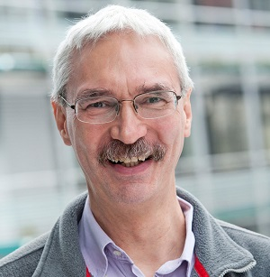
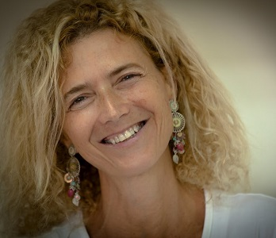
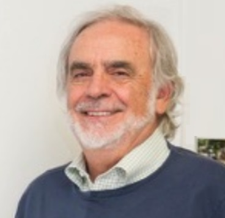

 
 

          

            

             
            

          

 

## 15 Years of Knowledge Graphs: Lessons, Challenges, Opportunities
#### Gerhard Weikum - Max Planck Institute for Informatics, Germany

**Abstract:** Machines with comprehensive knowledge of the world's entities
and their relationships has been a long-standing vision and challenge
of AI. Over the last 15 years, huge knowledge bases, also known as
knowledge graphs, have been automatically constructed from web data
and text sources, and have become a key asset for search, analytics,
recommendations and data integration. This digital knowledge can be
harnessed to semantically interpret textual phrases in news, social media
and web tables, contributing to question answering, natural language
processing and data analytics. This talk reviews these advances and discusses
lessons learned. Moreover, it identifies open challenges and new
research opportunities.

**About the Speaker:**  Gerhard Weikum is a Scientific Director at the Max Planck Institute for Informatics in Saarbruecken, Germany, and an Adjunct Professor at Saarland University. 
He co-authored a comprehensive textbook on transactional systems, received the VLDB Test-of-Time Award 2002 for his work on automatic database tuning, and is one of the creators of the YAGO knowledge base which was recognized by the WWW Test-of-Time Award in 2018. 
Weikum received the ACM SIGMOD Contributions Award in 2011, a Google Focused Research Award in 2011, an ERC Synergy Grant in 2014, and the ACM SIGMOD Edgar F. Codd Innovations Award in 2016.

[Gerhard Weikum website](http://people.mpi-inf.mpg.de/~weikum/)

 <!-- ------------------------------- -->

          

            

              
            

          

 

## Getting Rid of Data
#### Tova Milo - Tel Aviv University, Israel

**Abstract:** We are experiencing an amazing data-centered revolution.
Incredible amounts of data are collected, integrated and analyzed, leading to key breakthroughs in science and society. This well of knowledge,
however, is at a great risk if we do not dispense with some of the data
flood. First, the amount of generated data grows exponentially and already at 2025 is expected to be more than five times the available storage.
Second, even disregarding storage constraints, uncontrolled data retention risks privacy and security, as recognized, e.g., by the recent EU Data
Protection reform. Data disposal policies must be developed to benefit and protect organizations and individuals.
Retaining the knowledge hidden in the data while respecting storage, processing and regulatory constraints is a great challenge. The difficulty stems from the distinct, intricate requirements entailed by each type of
constraint, the scale and velocity of data and the constantly evolving
needs. While multiple data sketching, summarization and deletion techniques were developed to address specific aspects of the problem, we are
still very far from a comprehensive solution. Every organization has to
battle the same tough challenges, with ad hoc solutions that are application specific and rarely sharable.
In this talk I will discuss the logical, algorithmic, and methodological
foundations required for the systematic disposal of large-scale data, for
constraints enforcement and for the development of applications over the
retained information. I will overview relevant related work, highlighting
new research challenges and potential reuse of existing techniques, as
well as the research performed in this direction in the Tel Aviv Databases
group.

**About the Speaker:** Tova Milo received her Ph.D. degree in Computer Science from the Hebrew University, Jerusalem, in 1992. After graduating she worked at the INRIA research institute in Paris and at University of Toronto and returned to Israel in 1995, joining the School of Computer Science at Tel Aviv university, where she is now a full Professor and holds the Chair of Information Management. She served as the Head of the Computer Science Department from 2011-2014. Her research focuses on large-scale data management applications such as data integration, semi-structured information, Data-centered Business Processes and Crowd-sourcing, studying both theoretical and practical aspects. Tova served as the Program Chair of multiple international conferences, including PODS, VLDB, ICDT, XSym, and WebDB, and as the chair of the PODS Executive Committee. She served as a member of the VLDB Endowment and the PODS and ICDT executive boards and as an editor of TODS, IEEE Data Eng. Bull, and the Logical Methods in Computer Science Journal. Tova has received grants from the Israel Science Foundation, the US-Israel Binational Science Foundation, the Israeli and French Ministry of Science and the European Union. She is an ACM Fellow, a member of Academia Europaea, a recipient of the 2010 ACM PODS Alberto O. Mendelzon Test-of-Time Award, the 2017 VLDB Women in Database Research award, the 2017 Weizmann award for Exact Sciences Research, and of the prestigious EU ERC Advanced Investigators grant.

[Tova Milo website](https://www.cs.tau.ac.il/~milo/)

 <!-- ------------------------------- -->

          

            

              
            

          

 

## Usability, Performance and Scalability for Expressive Data Languages via Cardinality-Based Aggregates
#### Carlo Zaniolo - University of California, Los Angeles, USA

**Abstract:** In theory, the combined use of recursion and negation allows the
declarative expression of very powerful algorithms in languages such as Datalog or SQL. However, the diffculty of writing such programs and proving that
they satisfy formal non-monotonic semantics makes such an approach totally
impractical for software developers. Thus, we propose a new general solution to
the problem of developing advanced applications in logic-based languages. Our
approach is based on the combined use of recursion and aggregates endowed
with a unified definition of their semantics based on cardinality. In fact, we show
that this entails the expression on a wide range of algorithms used in ML, data-mining and graph applications, which can be very appealing for practitioners
because of (i) the compactness of their code, (ii) a simplified proof or verification for their stable-model semantics, (iii) their effcient implementations via a
max-optimized semi-naive fixpoint algorithm, and (iv) their superior scalability
via Stale-Synchronous Parallelism. To demonstrate and further enhance the usability of our proposed framework, including the several efficient and scalable
applications we developed, we provide a Logical Algorithm Library (Llib) and a
Logical Data-Frame System (LFrame). By integrating access to Llib libray with
other Apache Spark libraries, and supporting the interoperability of our BigDatalog, RaSQL, and Datalog-ML systems with Scala, Java and Python, LFrame
turns Datalog into a powerful and attractive tool for advanced application development in the Spark ecosystem.

**About the Speaker:** 	Carlo Zaniolo was born in Vicenza, Italy. He received an E.E. Engineer degree at Padua University in 1968, and M.S. and Ph.D. degrees in Computer Science at UCLA in 1970 and 1976, respectively. After working at Bell Laboratories, Murray Hill, NJ, and MCC in Austin Texas, Dr. Zaniolo joined the UCLA CS Department in 1991, and was awarded the N.E. Friedmann Chair in Knowledge Science. He received the 2012 SIGMOD Best Paper award, and a Google Research Faculty Award in 2015.
Dr. Zaniolo's interests include big data and knowledge based systems, non-monotonic and temporal reasoning,  internet information systems, answering questions, queries and searches in knowledge bases.

[Carlo Zaniolo website](http://web.cs.ucla.edu/~zaniolo/)

 <!-- ------------------------------- -->
