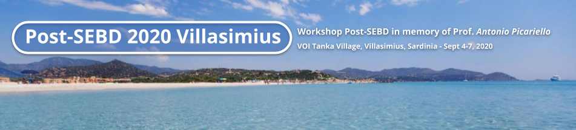

          

            

             
            

          

 

The **Workshop *Post-SEBD* in memory of Prof. Antonio Picariello (Post-SEBD2020)** will be jointly organized by University of Cagliari and ICT-SUD Cosenza, with the participation of Politecnico di Milano, University of Padua and University of Bologna, as a forum 
for the Italian database research community to meet in person to discuss cutting edge research and commemorate Antonio Picariello who passed away prematurely on June 23, 2020, while the [SEBD 2020 conference](https://sebd2020.unica.it/) was taking place.

The Post-SEBD Workshop will take place in Villasimius (Sardinia), Italy, at [VOI Tanka Village Resort](https://www.voitankavillage.com/) from the 4th to the 7th of September 2020.

## Workshop Program (temptative)

|    | Friday September 4, 2020 - Open Session on [HOPE Project](https://sites.google.com/diag.uniroma1.it/prin-hope2017)   <small class="text-muted">Chair: Prof. Maurizio Lenzerini </small>   <small class="text-muted">Local organization by UniCA (Prof. Maurizio Atzori)</small>   |
| ------ | ----------------------- |
| 15.00-15.15 | **Workshop Opening**   |
| 15.15-16.45 | HOPE project meeting: presentations and discussions   |
| 16.45-17.15 | Coffee Break  |
| 17.15-19.00 | HOPE project meeting: presentations and discussions  |
| 19.00-21.00 | Opening Social Dinner   |

|    | Saturday September 5, 2020 -   Session in Honor of Prof. Antonio Picariello "Picus"  |
| ------ | ----------------------- |
| | Breakfast   |
| 9.30-9.45 | Opening   |
| 9.45-12.00 | **"Picus" and his work**   |
| 12.00-14.00 | Lunch   |
| 14.00-20.30 | free time   |
| 20.30- | ***Cena Sarda* Social Dinner**    |

|     |   Monday September 7, 2020  -  *Give-me-a-Feedback* Session    |
| ------------- | ------------- |
| | Breakfast   |
| 9.30-11.30 | <b>  - Free Research Talks on ongoing work and cutting edge ideas   - Opportunity for young researchers to share ideas and  receive feedbacks and mentoring from senior professors </b>  |
| 11.30-12.00 |  <b> Closing and Communications </b> |
| 12.00-14.00 | Lunch   |

Costs (*to be confirmed*)
-----------------------
 * Registration: 150 Euro + VAT
 * Accomodation and meals:
    * 165 Euro + VAT per day per single registered participant
    * 250 Euro + VAT per day per double room (2 registered participants)
    * additional costs with special prices for kids and accompanying persons.

Accomodation will include full board:
   - buffet dinner (on the day of arrival and following)
   - breakfast (after first night and following)
   - buffet lunch (after first night and following)
   - meals also include drinks on tap (natural and sparkling water, non-alcoholic drinks, beer, wine).
   
All invoices will be sent by ICT-SUD in the next days, applied VAT is 22% for all costs including accomodation. 
For any special requirement regarding the booking, participants should contact Maurizio Atzori (*atzori@unica.it*).
For special administrative/fiscal needs regarding the invoice, administrative stuff from universities may contact Mrs. Concetta De Paola ([ICT-SUD](https://www.cc-ict-sud.it/)) by email at *concetta.depaola@cc-ict-sud.it*
   

Transfer from/to Cagliari Airport
---------------------------------
In the following some suggestions for the transfer from/to the closest airport (*Cagliari-Elmas "Mario Mameli" Airport*):

 - *Concierge by Tanka Village Resort*. Drop an email to `tanka@voiconcierge.com` for a request
 - *ARST (Regional Public Buses)*. Download the [dedicated mobile app](https://play.google.com/store/apps/details?id=com.sardegna.trasporti.arsttrasporti&hl=it) or check for [line 101](http://www.arstspa.info/101.pdf) and [line 135](http://www.arstspa.info/135.pdf).
 All ARST buses are also available for search on [Google Maps](http://www.arst.sardegna.it/orari_e_autolinee/Servizi_extraurbani.html)
 - *[Villasimius Express](http://www.villasimiusexpress.it/mobile/informazioni-utili/)*. Direct minivans from Cagliari Airport to Villasimius and Tanka Resort (book in advance)
 - *NCC (Noleggio Con Conducente) and Taxi*. There are many services with contacts available online (book in advance), e.g.: [TravelRent](http://travelrent.it/), [EasyTransfer Sardinia](http://www.easytransfersardinia.it/), [Transfer Cagliari](http://www.transfer-cagliari.it/), [Bratzu Autoservizi](https://www.autoservizibratzu.it/servizi/taxi-ncc-aeroporto-cagliari-tanka-village.php).
 - *Rent a Car*. Many services available from the Cagliari Airport (book online in advance).

